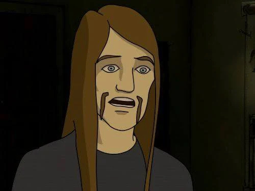
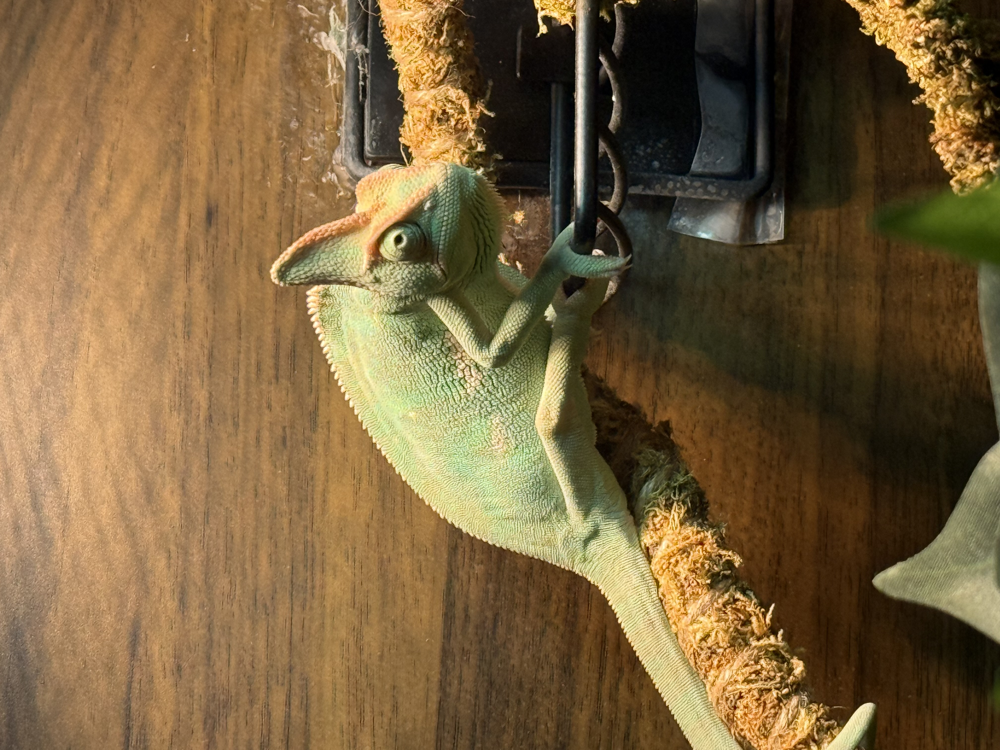

<html lang="en">
<head>
  <meta charset="UTF-8" />
  <meta name="viewport" content="width=device-width, initial-scale=1.0" />
  <meta name="description" content="Personal GitHub profile page focused on networking, information security, instrumentation, and electrical technician interests." />
  <meta property="og:title" content="Technical Portfolio | Networking, Security & Electrical Systems" />
  <meta property="og:description" content="A simple personal profile page for GitHub showcasing networking, information security, instrumentation, and electrical interests." />
  <title>Technical Portfolio</title>
  <link rel="preconnect" href="https://fonts.googleapis.com">
  <link rel="preconnect" href="https://fonts.gstatic.com" crossorigin>
  <link href="https://fonts.googleapis.com/css2?family=Space+Grotesk:wght@500;700&family=Inter:wght@400;500;600;700&display=swap" rel="stylesheet">
  
</head>
<body>
  <a class="skip-link" href="#main-content">Skip to content</a>
  <header class="site-header">
    

      <a class="brand" href="#top" aria-label="Back to top">
        <svg viewBox="0 0 48 48" fill="none" xmlns="http://www.w3.org/2000/svg" aria-hidden="true">
          <rect x="4" y="8" width="16" height="32" rx="4" stroke="currentColor" stroke-width="3"/>
          <path d="M20 16H31C36.523 16 41 20.477 41 26V26C41 31.523 36.523 36 31 36H20" stroke="currentColor" stroke-width="3" stroke-linecap="round"/>
          <path d="M10 16V32" stroke="currentColor" stroke-width="3" stroke-linecap="round"/>
          <circle cx="31" cy="26" r="3" fill="currentColor"/>
        </svg>
        Network • Security • Systems
      </a>
      

        <a class="button button--secondary" href="#focus">View focus areas</a>
        <button class="theme-toggle" type="button" data-theme-toggle aria-label="Switch color theme">
          <svg width="20" height="20" viewBox="0 0 24 24" fill="none" stroke="currentColor" stroke-width="2" aria-hidden="true">
            <path d="M21 12.79A9 9 0 1 1 11.21 3 7 7 0 0 0 21 12.79z"></path>
          </svg>
        </button>
      

    

  </header>
  <main id="main-content">
    <section class="hero container" id="top">
      

        

          Technical profile
          <h1>Networking, security, and industrial systems with a hands-on mindset.</h1>
          

            I am building a career around networking and information security while staying closely connected to instrumentation, electrical troubleshooting, and reliable field systems. This page is designed as a clean public GitHub profile landing page that highlights technical direction, interests, and practical strengths.
          

          

            <a class="button button--primary" href="#projects">Explore strengths</a>
            <a class="button button--secondary" href="#contact">GitHub-ready layout</a>
          

        

        <aside class="portrait-card" aria-label="Profile headshot card">
          

            
          

          

            Public profile
            Tech + field systems
          

        </aside>
      

    </section>
    <section class="section container" id="focus">
      

        <h2>Core focus areas</h2>
        
These sections frame the mix of digital infrastructure knowledge and real-world technical interest that makes the page feel specific to your background.

      

      

        <article class="card">
          
01 • Networking

          <h3>Network foundations</h3>
          
Interest in routing, switching, structured troubleshooting, connectivity planning, and the systems thinking needed to keep infrastructure stable and efficient.

        </article>
        <article class="card">
          
02 • InfoSec

          <h3>Security mindset</h3>
          
Focused on secure design, defensive thinking, risk awareness, access control, and the habit of looking for weaknesses before they become problems.

        </article>
        <article class="card">
          
03 • Electrical

          <h3>Instrumentation & controls</h3>
          
Strong interest in instrumentation, electrical systems, troubleshooting logic, and the connection between digital systems and physical equipment.

        </article>
      

    </section>
    <section class="section container" id="projects">
      

        <article class="highlight-panel">
          

            <h2>What I bring</h2>
            
A balanced profile that combines structured IT knowledge with curiosity about industrial and electrical environments.

          

          <ul class="bullet-list">
            <li>Clear interest in networking and information security principles</li>
            <li>Hands-on mindset suited for diagnostics, maintenance, and troubleshooting</li>
            <li>Curiosity about control systems, instrumentation signals, and electrical workflows</li>
            <li>Strong fit for projects where reliability, safety, and system awareness matter</li>
          </ul>
        </article>
        <aside class="highlight-panel">
          
Technical themes

          <h3 style="margin-top:0; margin-bottom: 0.75rem; font-size: var(--text-lg);">Keywords for your GitHub page</h3>
          
Use these as section anchors, repo topics, or pinned project language to keep your public profile consistent.

          

            Network Security
            Routing & Switching
            Cyber Defense
            Instrumentation
            Electrical Systems
            Industrial Tech
            Troubleshooting
            Systems Reliability
          

        </aside>
      

    </section>
    <section class="section container" id="chameleon">
      

        <article class="highlight-panel">
          

            <h2>Chameleon corner</h2>
          

          

            Chunk the chameleon loved her figs,
            Fat on sugar, thick on twigs.
            Flies were easy—life was sweet,
            ’Til one day there was no treat.
            Hungry, heavy, off she crept,
            To hunt where leaner hunters leapt.
            Crickets taught her how to move,
            Miss, then learn, then slowly improve.
            Now flies are snacks, not all she knows—
            She climbs, she hunts, her strength still grows.
            Soft and round, yet wise and free:
            Don’t let comfort still your tree.
          

          

            Personal Interest
            Reptile Care
            Profile Detail
          

        </article>
        <aside class="highlight-panel">
          
        </aside>
      

    </section>
  </main>
  <footer class="footer container">
    

      

        <strong style="display:block; margin-bottom: 0.35rem;">Technical profile page</strong>
        Have a great Day! Thank you for taking the time to view my profile.
      

      Static HTML • Mobile friendly • Dark mode
    

  </footer>
  
</body>
</html>
